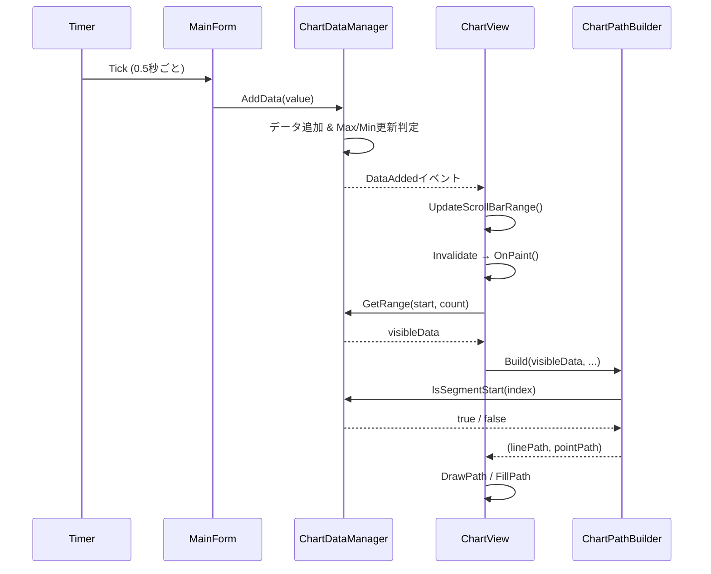
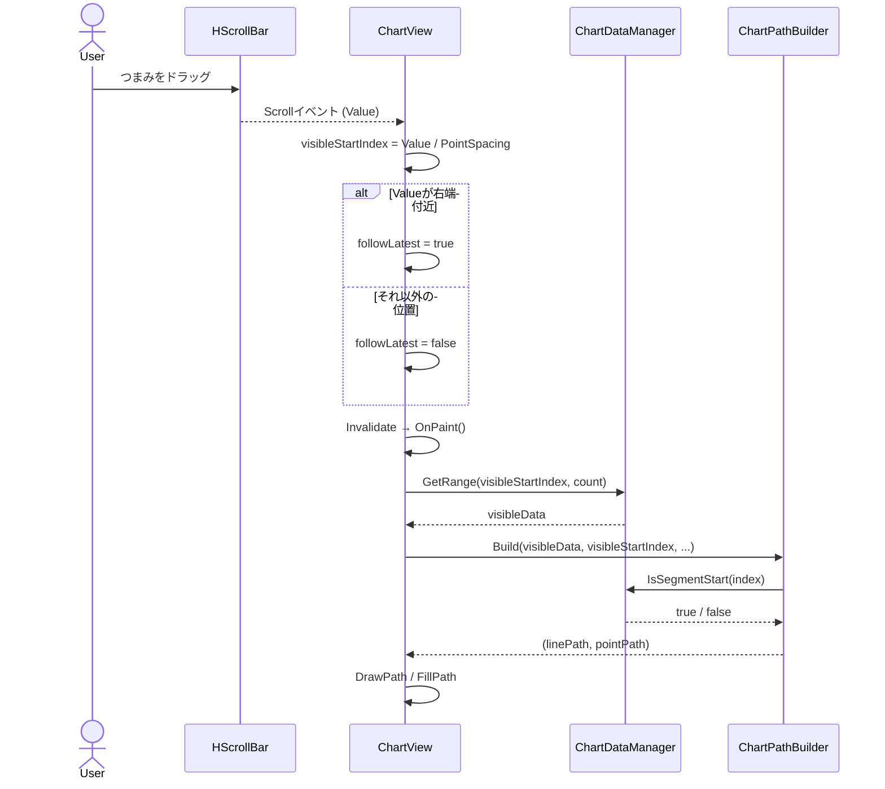

# シーケンス図

## 1. データ追加フロー（0.5秒ごとのTick〜再描画まで）

```mermaid
sequenceDiagram
    participant Timer
    participant MainForm
    participant ChartDataManager
    participant ChartView
    participant ChartPathBuilder

    Timer->>MainForm: Tick (0.5秒ごと)
    MainForm->>ChartDataManager: AddData(value)
    ChartDataManager->>ChartDataManager: データ追加 & Max/Min更新判定
    ChartDataManager-->>ChartView: DataAddedイベント
    ChartView->>ChartView: UpdateScrollBarRange()
    ChartView->>ChartView: Invalidate → OnPaint()
    ChartView->>ChartDataManager: GetRange(start, count)
    ChartDataManager-->>ChartView: visibleData
    ChartView->>ChartPathBuilder: Build(visibleData, ...)
    ChartPathBuilder->>ChartDataManager: IsSegmentStart(index)
    ChartDataManager-->>ChartPathBuilder: true / false
    ChartPathBuilder-->>ChartView: (linePath, pointPath)
    ChartView->>ChartView: DrawPath / FillPath
```

## 2. スクロールバー操作フロー

```mermaid
sequenceDiagram
    actor User
    participant HScrollBar
    participant ChartView
    participant ChartDataManager
    participant ChartPathBuilder

    User->>HScrollBar: つまみをドラッグ
    HScrollBar-->>ChartView: Scrollイベント (Value)
    ChartView->>ChartView: visibleStartIndex = Value / PointSpacing
    alt Valueが右端付近
        ChartView->>ChartView: followLatest = true
    else それ以外の位置
        ChartView->>ChartView: followLatest = false
    end
    ChartView->>ChartView: Invalidate → OnPaint()
    ChartView->>ChartDataManager: GetRange(visibleStartIndex, count)
    ChartDataManager-->>ChartView: visibleData
    ChartView->>ChartPathBuilder: Build(visibleData, visibleStartIndex, ...)
    ChartPathBuilder->>ChartDataManager: IsSegmentStart(index)
    ChartDataManager-->>ChartPathBuilder: true / false
    ChartPathBuilder-->>ChartView: (linePath, pointPath)
    ChartView->>ChartView: DrawPath / FillPath
```
